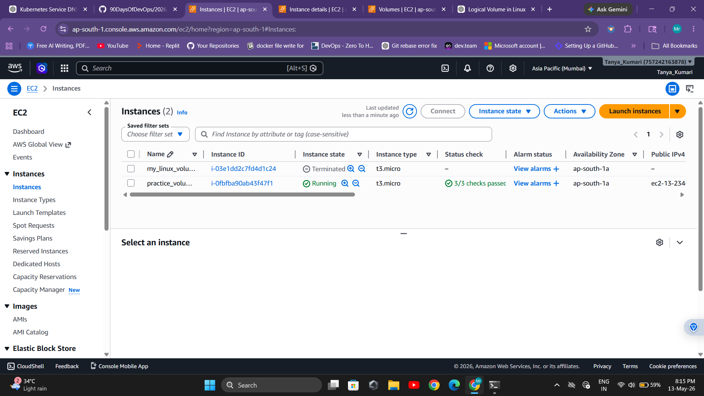
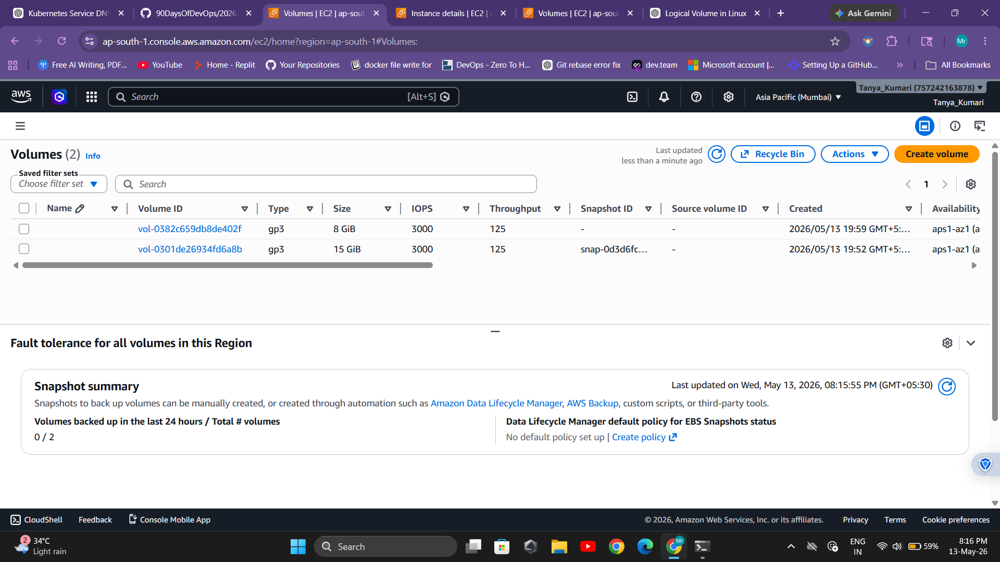
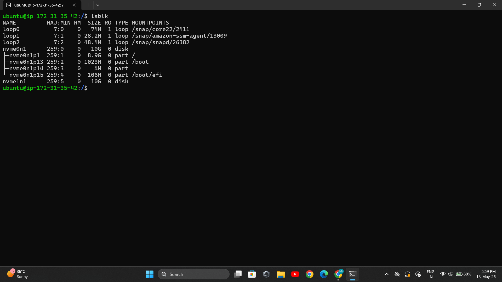
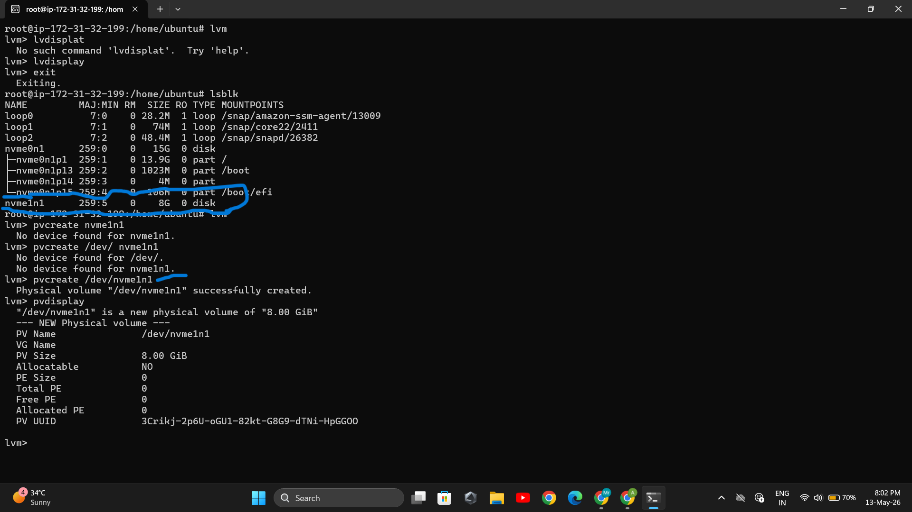

# Day 13 – Linux Volume Management (LVM)

## Objective

Learn how to use LVM (Logical Volume Manager) to create, manage, extend, and mount flexible storage in Linux.

---

## Prerequisites

Switch to root user:

```bash
sudo -i
```

OR

```bash
sudo su
```

---

## Creating Virtual Volume (AWS)

```bash
create an instance
Add volume 
```

### Output




### Output



---

## Task 1: Check Current Storage

**Intro:** Understand current disks, partitions, and storage usage available in the system before creating LVM setup.

```bash
lsblk
```

### Output



```bash
pvs
vgs
lvs
df -h
```

### Output


---

## Task 2: Create Physical Volume

**Intro:** Initialize a raw disk or partition into a Physical Volume so that LVM can manage it.

```bash
pvcreate /dev/nvme1n1  
```

### Output



```bash
pvs
```

### Output


---

## Task 3: Create Volume Group

**Intro:** Combine one or more Physical Volumes into a single storage pool called a Volume Group.

```bash
vgcreate backup /dev/nvme1n1
```

### Output

.png)

```bash
vgs
```

### Output


---

## Task 4: Create Logical Volume

**Intro:** Create a flexible virtual partition from the Volume Group that will act like a real disk.

```bash
lvcreate -L 500M -n app-data devops-vg
```

```bash
lvs
```

### Output


---

## Task 5: Format and Mount

**Intro:** Format the Logical Volume with a filesystem and mount it to make it usable in the directory structure.

```bash
mkfs.ext4 /dev/devops-vg/app-data
```

### Output


```bash
mkdir -p /mnt/app-data
mount /dev/devops-vg/app-data /mnt/app-data
```

```bash
df -h /mnt/app-data
```

### Output


---

## Task 6: Extend the Volume

**Intro:** Increase the size of the Logical Volume and resize filesystem without stopping services.

```bash
lvextend -L +200M /dev/devops-vg/app-data
```

```bash
resize2fs /dev/devops-vg/app-data
```

```bash
df -h /mnt/app-data
```

### Output


---

## Summary (What I Learned)

1. Learned how PV, VG, and LV work in LVM.
2. Understood how to create and mount logical volumes.
3. Learned how to extend storage without downtime.

---

## Key Concepts

* Physical Volume (PV)
* Volume Group (VG)
* Logical Volume (LV)
* Dynamic storage management
* Flexible resizing without repartition

---

## Submission Steps

* Save file as `day-13-lvm.md`
* Place in `2026/day-13/`
* Commit and push to GitHub

---

## Note

Make sure to replace all `images/*.png` with your actual screenshots after running commands.

---

## Hashtags

#90DaysOfDevOps #DevOpsKaJosh #TrainWithShubham #Linux #LVM
